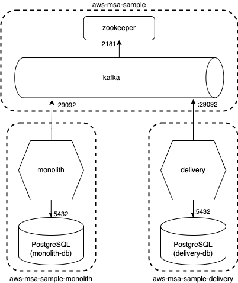

# aws-msa-sample

이 프로젝트는 [aws-msa-sample-monolith](https://github.com/ddongEee/aws-msa-sample-monolith) 서비스와 [aws-msa-sample-delivery](https://github.com/ddongEee/aws-msa-sample-delivery)를 위한 Umbrella 프로젝트입니다.

## Overview

이 프로젝트는 다음과 같은 구조로 구성되어 있습니다. (1/10 현재 아직 DB 구성이 완료되지는 않았습니다.)


## Usage

### 소스 업데이트하기

``` shell
make update
```

### 시작하기

``` shell
make start
```

### 종료하기

``` shell
make stop
```

### 종료 -> 빌드 -> 시작

전체 종료 후 각 소스 업데이트하여 빌드하고 다시 시작합니다.

``` shell
make
```

### 로그 보기

``` shell
make logs
```

### docker process 확인

``` shell
make ps
```
